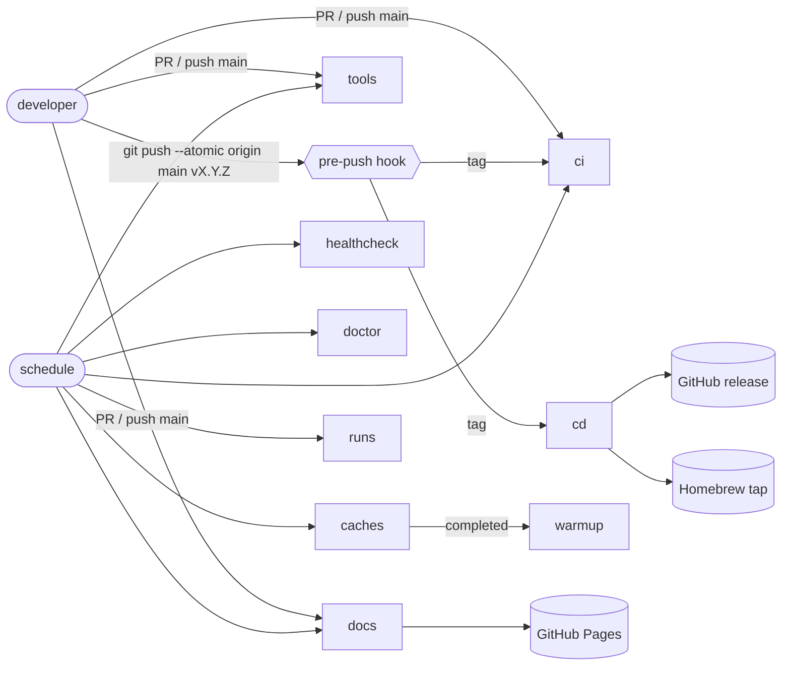
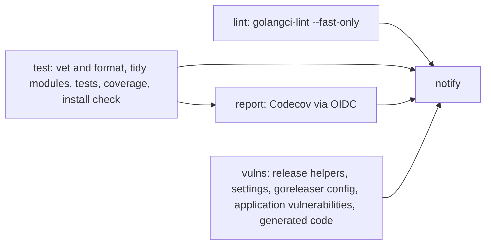
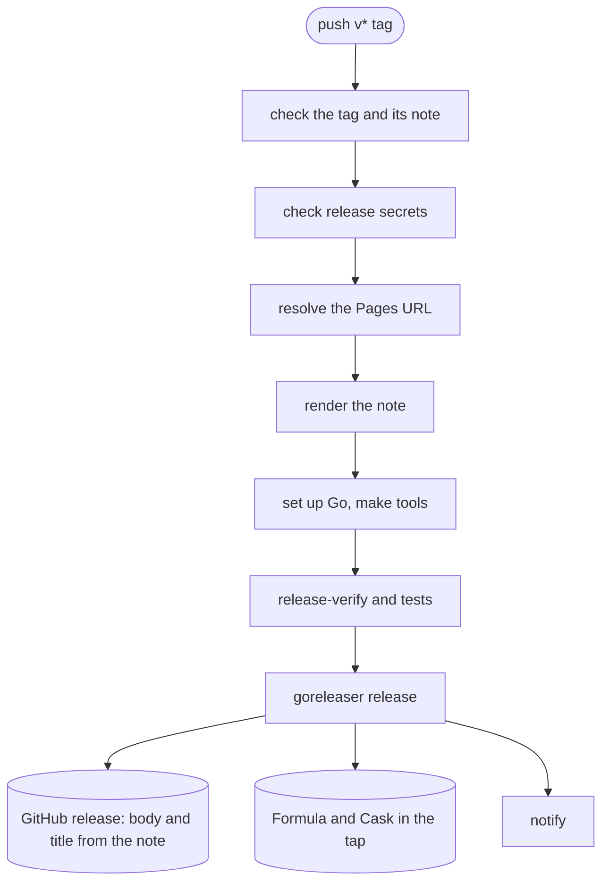
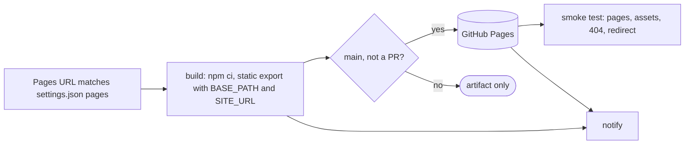
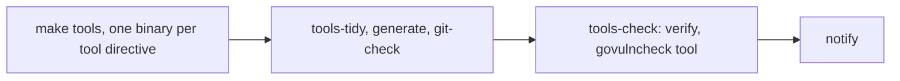
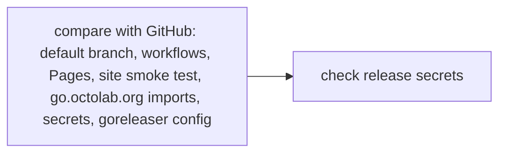
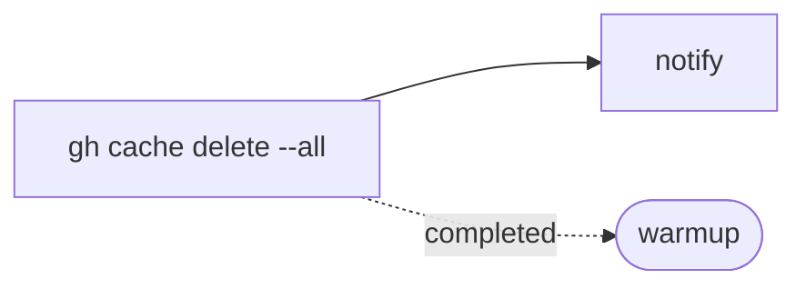
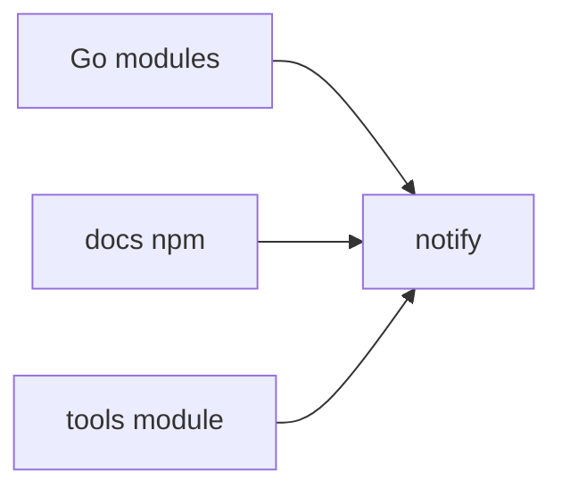
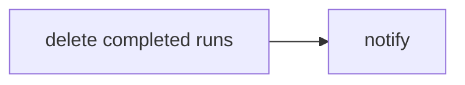

# GitHub Actions

| Workflow | Name | Runs on | Does |
| --- | --- | --- | --- |
| [ci](#ci) | Continuous integration | PR and push to main (Go files, release config), `v*` tag, monthly, manual | Lint, tests, coverage to Codecov, vulnerabilities, release config |
| [healthcheck](#healthcheck) | Continuous integration healthcheck | daily, manual | Refresh the GitHub fixtures and run the tests against them |
| [cd](#cd) | Continuous delivery | `v*` tag, manual | Check the tag, test, publish the release, the Homebrew Formula and Cask; a snapshot on manual runs |
| [docs](#docs) | Documentation delivery | PR and push to main (`docs/`), monthly, manual, reusable | Build the site; deploy it to Pages from main |
| [tools](#tools) | Tools validation | PR and push to main (`tools/`), monthly, manual | Install the tools module, check generated code and tool vulnerabilities |
| [doctor](#doctor) | Repository doctor | daily, manual | Compare the repository with GitHub and explain fixes |
| [caches](#caches) | Workflow caches cleanup | monthly, manual, reusable | Delete all Actions caches |
| [warmup](#warmup) | Workflow caches warmup | after caches cleanup, manual | Refill Go, docs and tools caches |
| [runs](#runs) | Workflow runs cleanup | monthly, manual, reusable | Delete completed runs, with a dry run |

Schedules are in UTC: cleanups, the healthcheck and the doctor at 06:00, checks at 07:00, monthly on day 1.



## Common ground

- All external actions use concrete release tags; Dependabot checks the
  `github-actions` ecosystem daily. Review upstream changes and the action
  contract before accepting an update.
- GitHub-hosted Ubuntu runners (`ubuntu-24.04`) supply the runtime the actions need.
- Go follows the current stable release: `go.mod`, `tools/go.mod`, `GO_VERSIONS`
  in the `Makefile` and every `setup-go` move together; tests also run on `1.x`.
- Workflow permissions default to `contents: read`; publishing and maintenance
  jobs request more explicitly.
- Every workflow except doctor ends with a `notify` job that posts to Slack.
  `SLACK_WEBHOOK` is optional: an empty value skips the notification. Commit
  messages and dispatch reasons reach the message through environment variables.
- Secrets are checked by `make doctor`, which prints how to create a missing one.

| Secret | Used by | Purpose |
| --- | --- | --- |
| `HOMEBREW_TAP_TOKEN` | cd, doctor | Push the Formula and the Cask to the tap named in `.goreleaser.yml` |
| `SLACK_WEBHOOK` | all but doctor | Notifications, optional |

### Set up GitHub

Nothing here is stored in the repository, so a fresh repository or a fork needs it once:

1. Settings → Pages → Source: **GitHub Actions**; the `github-pages` environment
   must allow deployments from main. Custom domain: `maintainer.octolab.org`,
   declared as `pages.cname` in `.github/settings.json`, with Enforce HTTPS on.
2. `HOMEBREW_TAP_TOKEN`: a fine-grained token owned by `octolab`, limited to
   `homebrew-tap` with Contents: Read and write, available to this repository.
   The release itself uses the workflow token.
3. Activate the repository in Codecov; the upload uses OIDC, no `CODECOV_TOKEN`.
4. Enable the workflows that were disabled by hand, after pushing the YAML that
   should run: `gh workflow enable <file> -R octomation/maintainer`. The doctor
   reports every workflow that is not active.

Then dispatch ci, tools, docs and healthcheck, run doctor after the first Pages
deployment, and dispatch cd on main for a snapshot. Do not dispatch the cleanups
to try them out: they delete data.

## ci

[ci.yml](ci.yml) keeps the main branch green and reports coverage.



- Runs on PRs and pushes to main that touch Go code (outside `tools/`),
  `go.mod`, `Makefile`, `Taskfile`, the lint or release configuration, the
  release helpers or hooks, or the workflow itself; on `v*` tags; monthly; manually.
- Every gate of the release runs here first: an untidy `go.mod`, a broken
  `.goreleaser.yml` or a vulnerable dependency fails on main, not on the tag.
- `vulns` scans the application only; tool vulnerabilities belong to [tools](#tools).
- Codecov uses GitHub OIDC (`id-token: write`). PRs get no notification.

## healthcheck

[ci.healthcheck.yml](ci.healthcheck.yml) catches GitHub changing the markup of
the contribution calendar: it downloads fresh profile pages with
`./Taskfile testdata` and runs the tests against them. The committed fixtures
stay as they are; the capture year reaches the tests through
`MAINTAINER_TESTDATA_YEAR`.

## cd

[cd.yml](cd.yml) publishes a release from a tag.



- **A release is a curated note plus a tag.** Write `docs/content/changelog/<tag>.md`:
  frontmatter `title` and `description`, the first line `# <title>`, Markdown
  and HTML, no MDX, site-relative links. Commit it, tag the commit, run
  `make release-check TAG=<tag>`, then push the branch and the tag in one go:
  `git push --atomic origin main <tag>`.
- **Guardrails come first and fail in seconds.** `make release-check` checks the
  tag against the local branch, before it is pushed, together with tidy modules
  and the GoReleaser config. The `pre-push` hook (`.github/hooks`, wired by
  `make hooks`, part of `make init`) runs `.github/scripts/release.mjs check`
  against the branch of the same push, then the application checks of every
  push, `make deps-tidy verify`. The first steps here repeat the tag check
  against `origin` for pushes that bypassed the hook, then verify
  `HOMEBREW_TAP_TOKEN` can read the tap, all before Go is even installed.
- **The note becomes the release.** `release.mjs render` strips the frontmatter
  and the H1, makes site links absolute from the Pages URL and hands the title
  to goreleaser (`release.name_template`).
- **Policy lives in `.github/settings.json`**, documented by `.github/settings.cue`:
  tag pattern, maintenance branches (e.g. `v5.*` tags on branch `v5`), note path.
- The Cask serves macOS and Linux. The Formula keeps existing installations
  updated and is deprecated from 2026-11-05 in favour of the Cask, see
  [#456](https://github.com/octomation/maintainer/issues/456). Homebrew
  cannot declare a conflict between a formula and a cask, so the Formula
  carries a caveat and the Cask preflight warns when the Formula owns the
  binary link. GoReleaser deprecates `brews`, so `make release-config-check`
  accepts exactly that deprecation and fails on any other.
- The binary is neither signed nor notarized. The Cask preflight clears its
  quarantine attribute: it has to run before the completions are generated,
  which execute the binary, so a `postflight` hook would be too late.
- A manual run on a branch builds a snapshot and publishes nothing; on a tag it
  publishes, as a tag push does.

## docs

[docs.yml](docs.yml) builds the Nextra site and deploys it to GitHub Pages.



- Runs on PRs and pushes to main that touch `docs/`, `.github/settings.json`,
  the release helpers, `Taskfile` or the notify action; monthly; manually; as a
  reusable workflow.
- On main, `BASE_PATH` and `SITE_URL` come from the Pages configuration; PR
  previews take them from `.github/settings.json` and need no Pages access.
- No `CNAME` file is needed: a custom domain is set in Settings → Pages and
  declared as `pages.cname` in `.github/settings.json`; the build stops while
  they disagree. The domain is baked into the build, so rebuild after changing
  it, see [docs/readme.md](../../docs/readme.md#change-the-domain).
- Independent of releases: merge a note and its new pages before tagging if the
  release must link to them from the first minute.

## tools

[tools.yml](tools.yml) keeps the tools module installable and its generated code in sync.



- Runs on PRs and pushes to main that touch `tools/**.go`, `tools/go.mod`,
  `tools/go.sum`, the `Makefile` or the workflow itself; monthly; manually.
- The vulnerability scan of the tools fails only this workflow, never CI or a
  release; see [tools/README.md](../../tools/README.md).

## doctor

[doctor.yml](doctor.yml) runs `release.mjs doctor` and `preflight` in CI; `make doctor` runs the first one locally.



- Daily and manual: a Pages domain change triggers no workflow, so a site
  built for the old domain is caught here. Each problem is printed with what
  to fix and where.
- `go.octolab.org` is in `GOPRIVATE`, so `go` resolves it directly: every
  vanity module in `go.mod` and `tools/go.mod` must answer `?go-get=1` over
  verified HTTPS with a `go-import` tag. A lapsed certificate fails here before
  a fresh runner hits it; `node .github/scripts/release.mjs vanity` checks
  only that.
- The workflow token cannot list secrets, so they show as `unverified` there;
  the preflight step checks the ones a release needs. Locally, `gh` sees the
  organization secrets shared with the repository.

## caches

[caches.yml](caches.yml) deletes every Actions cache with the built-in GitHub CLI.



## warmup

[warmup.caches.yml](warmup.caches.yml) refills the caches right after a successful cleanup.



The keys match the consumers: the Go matrix of ci and healthcheck use `go.sum`;
the tools job, ci `vulns` and cd use `tools/go.sum`.

## runs

[runs.yml](runs.yml) deletes completed workflow runs, without age or count retention.



- To clear the history, run it with `pattern: All` (the default) and `dry_run`
  unchecked. Scheduled and reusable runs also target all workflows, Dependabot
  included. Active runs, including this one, remain.
- The upstream action matches workflows by substring, so application CI is
  listed as `ci.yml`: its name is a part of the healthcheck's name.
- The upstream action also deletes orphaned runs of workflows that no longer
  exist, whatever their status or the selected workflow.

## Local checks

```sh
make tools
make source-check lint test TIMEOUT=2m
make deps-tidy tools-tidy generate git-check
make config-vet release-config-check deps-check
make tools-check
node --test .github/scripts/*.test.mjs
actionlint
make dist-check
```
